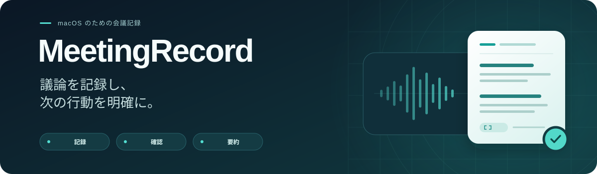
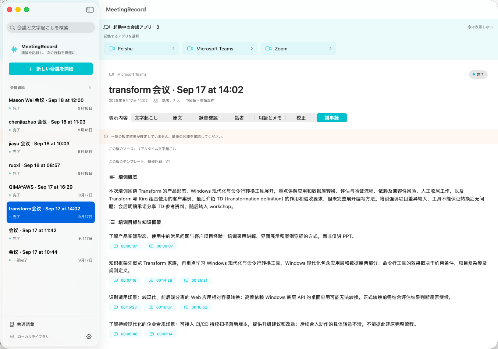

<p align="center">
  
</p>

<p align="center">
  <a href="README.md">English</a> · <a href="README.zh-CN.md">简体中文</a> · <a href="README.ja.md">日本語</a>
</p>

<p align="center"><strong>macOS 26+</strong> &nbsp; · &nbsp; SwiftUI &nbsp; · &nbsp; AWS Transcribe + Bedrock</p>

[PRD](PRD.md) に基づく、SwiftUI 製のネイティブなメニューバーアプリです。**0.6.1 は開発プレビュー版**で、中国語・英語・日本語の UI、リアルタイム文字起こし、会議後の録音確認、AI 校正、カスタマイズ可能な要約に対応しています。PRD の全機能が完成したものではありません。

## 画面紹介



<sub>日本語の UI。保存済みの会議内容の言語は変更されません。</sub>

## 表示言語

**設定 → 表示言語**で、**システムに合わせる / 简体中文 / English / 日本語**を選択できます。メイン画面、メニューバーのパネル、アプリ内の開いているダイアログにすぐ反映され、自動保存されます。既定値は「システムに合わせる」です。

システムの優先言語一覧から最初の対応言語を選び、該当する言語がなければ英語を使用します。中国語の地域別設定には簡体字を使用します。内蔵テンプレートの名前、説明、セクションのプレビューは翻訳しますが、会議内容、カスタムテンプレート、名前、手動修正、過去の版は変更しません。

表示言語は認識言語・要約言語とは独立しています。**リアルタイム・バッチ音声認識は中国語・日本語・英語、中国語と英語の混在、英語と日本語の混在に対応します。要約出力とカスタム語彙も 3 言語に対応します。** 表示言語を変更しても、これらの設定や過去の要約は変わりません。macOS が管理するメニュー、ファイル選択画面、権限ダイアログ、Finder の名前はシステムの言語設定に従います。[多言語対応の詳細](docs/LOCALIZATION.md)（中国語）も参照してください。

日本語・3 言語処理の設定、テスト、実際の AWS 検証は[日本語検証記録](docs/JAPANESE-VALIDATION.md)（中国語）を参照してください。

0.6.1 の混在モードは「中国語・英語」と「英語・日本語」の 2 種類です。旧 3 言語モードは過去の記録・ジョブの読み込み用に保持します。共通設定の既定値が旧 3 言語モードだった場合、新しい録音は中国語・英語に戻ります。[認識言語の詳細](docs/RECOGNITION-LANGUAGES.md)（中国語）を参照してください。

## ビルドと起動

macOS 26、Xcode Command Line Tools / Swift 6.2 以降が必要です。Swift Package Manager を使用し、完全版の Xcode は不要です。初回は AWS SDK と依存パッケージをダウンロードするため、ネットワーク接続と数 GB のキャッシュ容量が必要です。

```sh
bash scripts/test.sh
bash scripts/build-app.sh
open dist/MeetingRecord.app
```

別の出力先にビルドする場合：

```sh
bash scripts/build-app.sh debug dist/MeetingRecord-0.6.1.app
```

録音は、macOS の権限宣言と翻訳リソースを含む `.app` から開始してください。`swift run` だけではインストールや権限の検証にはなりません。生成物はローカルのアドホック署名を使用します。配布用署名、公証、安定した権限の識別情報は未対応です。

スクリプトはインストール済みの macOS 26 SDK を優先し、Command Line Tools での Swift Testing プラグイン検出にも対応します。開発環境の SDK 27 は Command Line Tools に含まれない SwiftUI マクロプラグインを必要とするため、上記スクリプトを使用してください。

## 主な機能

- メイン画面、メニューバー操作、会議履歴、文字起こしの検索。
- 起動中の **Teams、Zoom、飛書 / Lark、Tencent Meeting、DingTalk** の macOS クライアント、マイク、認識言語、クラウド文字起こし、音声キャッシュを選択。対応する起動中アプリをすべて表示し、記録対象を選べます。
- Core Audio Process Tap で選択したアプリと、そのアプリ内の確認済み音声補助プロセスを収録。マイクは AVAudioEngine で別に収録します。ブラウザ上の会議は対象外です。
- 音源別の音量・状態表示、一時停止・再開、手動のマイクミュート。Teams / Zoom のミュート状態には**自動追従しません**。ウィンドウを閉じても動作を継続し、処理中の終了時には確認します。
- 2 系統の AWS Transcribe Streaming を使用。音声形式は 16 kHz、16-bit、モノラル PCM、100 ms 単位です。混在モードは `IdentifyMultipleLanguages` と `zh-CN,en-US` または `en-US,ja-JP`、固定言語モードは各言語コードを使用し、相手側の音声には話者ラベルを要求します。
- 暫定結果を更新表示し、確定結果を重複排除して保存。原文は変更せず、手動修正、話者情報、統合、発言の割り当て、メモ、重要マークを別に管理します。
- SQLite WAL によるローカル保存。欠落、切断、未確定の最後の結果、キャッシュ失敗、中断を明示します。終了処理の待機は最大 12 秒です。
- Markdown / TXT の文字起こし・AI 版エクスポート、録音不要の操作サンプル。Markdown の引用は明示的な HTML アンカーへのリンクを使用するため、対応するビューアーが必要です。
- 原意を保つ AI 校正。提案ごとの確認と**すべて採用**に対応し、手動編集を保護します。重要情報の変更は確認が必要で、句読点の変更も取り消せます。
- 原文引用を検証するテンプレート別要約、版の選択、入力更新の警告、手動編集を新しい版として保存、保存済みの校正結果や要約段階からの再試行。
- 中国語・日本語・英語の共通 Transcribe 語彙、一括貼り付け、AWS 同期状態、内容別の版管理、未参照の旧版の削除。
- 会議後の任意のバッチ文字起こし。結果を確認してから採用でき、原文、手動修正、過去の AI 結果は保持します。

## 利用の流れ

1. 設定で AWS プロファイルとリージョンを指定します。必要に応じて語彙を登録し、READY になるまで同期します。
2. 対応するデスクトップクライアントで会議に参加します。音声ソースとマイクを選び、収録・クラウド処理の範囲を確認して記録を開始します。
3. 校正前に話者情報、用語、メモを補足します。メモは理解のための背景情報であり、会議中の発言の証拠にはなりません。
4. 必要に応じて**録音確認**から保持した録音をアップロードし、バッチ文字起こしを行います。比較して採用するか、リアルタイム版に戻します。話者ラベルや手動修正は版の間で自動移行しません。
5. 校正提案を確認し、要約テンプレートを選択して生成・エクスポートします。過去の版は残ります。

自動校正・要約は設定で無効にできます。バッチ再文字起こしは**既定では手動**です。自動モードにすると、新しい記録の終了後に実行します。自動バッチモードでは録音を保持し、自動 AI 処理より先にバッチ結果の確認・採用を待ちます。会議ごとに開始前に設定を変更できます。

録音の送信先には同じリージョンの S3 バケットを使用します。専用バケットが空欄なら共通語彙のバケットを使用します。中断後も送信済みジョブを再照会でき、結果のローカル保存後にクラウドの削除を試みます。削除に失敗した場合は再試行できます。ローカルで待機を停止しても AWS の処理と課金は継続する場合があります。[バッチ文字起こしの説明](docs/BATCH-TRANSCRIPTION.md)（中国語）を参照してください。

## 要約テンプレート

| テンプレート | 主な内容 |
| --- | --- |
| 会議議事録 | 議論、確定した決定事項、アクション項目、未確認事項 |
| 面接記録（面接官向け） | 経験、質疑応答、職務能力の根拠、実証された強み、追加質問、合意済みの対応 |
| 研修記録 | 学習目標、知識体系、概念、手順、事例、受講者の質疑応答、課題、不足情報 |

記録前、または校正・議事録画面で選択し、設定で既定のテンプレートを指定できます。**テンプレートを管理 → テンプレートを追加**では、名前、要約要件、概要タイトル、最大 16 個のセクションと順序を定義します。種類は要点、決定、担当者・期限付きアクション、未確認事項です。内蔵テンプレートは読み取り専用で、複製して編集できます。

ライブラリはローカルの `summaryTemplateLibrary` 設定に保存します。会議と生成した版にはテンプレート全体のスナップショットが残り、編集・削除しても過去の記録は書き換えません。カスタム見出しは入力したまま使用し、内蔵テンプレートの出力見出しは UI の表示言語ではなく、保存された要約言語に従います。

テンプレートの要件は生成時のみ Bedrock に送信します。事実の正確さ、原文引用、手動メモの区別に関するルールはテンプレートで無効化できません。面接テンプレートは採否を推測せず、機微な個人属性に基づく評価を行いません。

## AWS とデータ

- 既定は AWS プロファイル `default`、リージョン `us-west-2`。Transcribe のリージョンと 2 段階の AI 設定は個別に変更できます。
- AI は `https://bedrock-runtime.{region}.amazonaws.com/openai/v1/responses`、SigV4 サービス名 `bedrock`、Astra / Sol / Terra / Luna の `global.openai.*` 推論プロファイルを使用します。選択した接続先から AWS がリージョン間のルーティングを行う場合があります。過去のエンドポイント情報は保持します。
- 0.5.1 で 4 モデルすべての Runtime 接続を実際に検証済みです。利用可否は権限とアクセス地域にも依存します。モデル、リージョン、推論強度の自動変更や自動再試行は行いません。[Runtime 接続の詳細](docs/BEDROCK-RUNTIME.md)（中国語）を参照してください。
- SDK がローカルのプロファイルから認証情報を取得し、アプリは AWS キーを保存せず、リクエスト本文をログに記録しません。HTTP リダイレクトは無効です。
- リアルタイム文字起こしは 2 系統の音声を AWS に送り、別々に課金されます。バッチ文字起こしは保存した録音を S3 にアップロードし、追加料金が発生します。起動やサンプルの閲覧だけでは文字起こし・推論を呼び出しません。
- AI には確定済みの文字起こし、話者情報、用語、必要なメモを送信します。`store: false` は Responses の会話保存を無効にしますが、すべてのクラウドログやサービス側の保持を無効にするものではありません。
- 語彙の同期では、語句と表示表記を同じリージョンの既存 S3 バケットに送信します。ローカルメモは送信しません。新しい録音には READY の版のみ使用します。[語彙の設定と権限](docs/CUSTOM-VOCABULARY.md)（中国語）を参照してください。
- ローカルデータは `~/Library/Application Support/MeetingRecord/` に保存します。データベースとキャッシュのアクセスは現在のユーザーに制限していますが、追加のデータベース暗号化は未実装です。
- 新規インストール時の音声キャッシュは無効です。保存済みの設定は尊重します。有効時は会議を削除するまで録音を保持し、自動期限削除は行いません。
- 会議の削除はローカルの録音・文字起こし・メモを削除します。クラウドのデータは削除しません。未完了のバッチリソースは先に削除してください。S3 のバージョニングで古いオブジェクトが残る場合があります。

読み取り専用の環境確認：

```sh
python3 scripts/check-environment.py
python3 scripts/check-environment.py --aws --profile default --region us-west-2 --output docs/environment.json
```

録音、推論、アカウント ID や認証情報の保存は行いません。ターミナルで STS やモデル一覧の取得に成功しても、GUI のすべての認証方法やモデル権限が使えるとは限りません。

## 制限と検証状況

Teams でヘッドフォンを使用した 2 系統の収録・文字起こしはユーザーが確認済みです。Zoom、飛書、Tencent Meeting、DingTalk の実際の通話、混在言語での話者分離、デバイス切り替え、スピーカー利用時のエコー、2 時間の安定性は引き続き検証が必要です。[M0 検証](docs/M0-VALIDATION.md)、[Teams 音声の修正](docs/TEAMS-AUDIO-FIX.md)（中国語）を参照してください。

切断後も音声キャッシュと欠落区間の記録を継続でき、保持した録音を後でバッチ処理に送信できます。ストリームの自動再接続、録音の再生、キャッシュの自動削除は未実装です。再接続には一時停止・再開を使用してください。バッチ処理では 1 ファイルが 4 時間を超える録音に対応していません。失敗時も結果は保持しますが、文字起こしの完全性は保証しません。

## 構成

```text
Sources/MeetingCore        モデル、原文保護、修正、テンプレート、SQLite、エクスポート、多言語対応
Sources/MeetingAudio       アプリ音声 Tap、マイク、PCM 変換、ローカルキャッシュ
Sources/MeetingCloud       Transcribe リアルタイム／バッチ、語彙、Bedrock Responses、検証
Sources/MeetingRecordApp   SwiftUI、メニューバー、記録のライフサイクル
Sources/MeetingAIValidate  明示的なモデル／録音検証 CLI
Tests                     コア、音声、クラウド、多言語テスト（AWS 呼び出しなし）
Resources                 アイコン、翻訳済み権限説明、署名設定
scripts                   ビルド、テスト、読み取り専用の環境確認
docs                      機能の詳細と検証記録
```

CodeGraph インデックスはありません。`.codegraph/` が作成された場合のみコードの調査に使用します。アイコンの出典とライセンスは[アイコン説明](Resources/IconSource/README.md)に記載しています。

ビルド後に `.build/out/Products/Debug/MeetingAIValidate --probe-models` を実行すると、会議内容を含まない短い固定文で 4 モデルを確認し、最初のエラーで停止します。`--latest` または `--meeting UUID` は実際の会議を設定済みの AWS モデルに送信して結果を保存するため、明示的な許可がある場合のみ使用し、先にデスクトップアプリを終了してください。`--summary-only` は要約のみ再試行します。リリース履歴は[バージョン履歴](docs/CHANGELOG.zh-CN.md)を参照してください。
