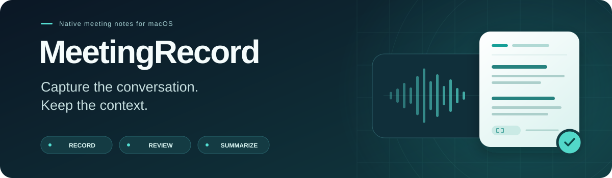
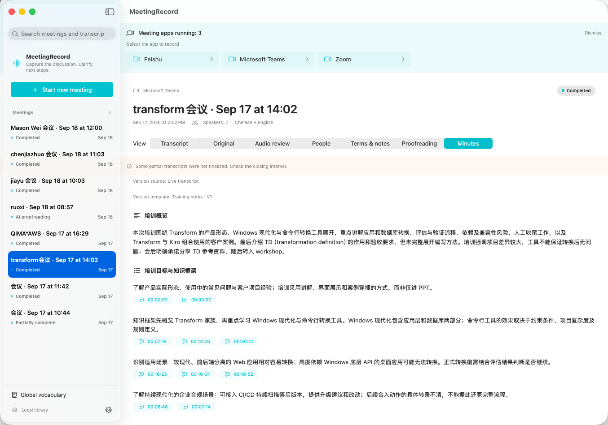

<p align="center">
  
</p>

<p align="center">
  <a href="README.md">English</a> · <a href="README.zh-CN.md">简体中文</a> · <a href="README.ja.md">日本語</a>
</p>

<p align="center"><strong>macOS 26+</strong> &nbsp; · &nbsp; SwiftUI &nbsp; · &nbsp; AWS Transcribe / Doubao + Responses API</p>

A native SwiftUI menu bar app based on the [PRD](PRD.md). **0.6.1 is a development preview** with Chinese, English, and Japanese interfaces, live transcription, post-meeting audio review, AI proofreading with selectable model providers, and customizable summaries. It does not yet implement the entire PRD.

Doubao streaming ASR 2.0 is now available with a single mixed stream or separate audio streams, two-pass utterance finalization, speaker labels, and estimated usage at CNY 0.93 per audio hour. Live transcription and recording review can use different providers. [Doubao recording review](docs/RECORDING-REVIEW-PROVIDERS.md) mixes tracks to mono with private S3 staging, estimated at CNY 0.80 per audio hour; the AWS workflow remains available. See [Doubao streaming setup](docs/DOUBAO-STREAMING.md).

## Preview



<sub>English interface. Saved meeting content keeps its own language.</sub>

## Interface language

Open **Settings → Interface language** and choose **Follow system**, **简体中文**, **English**, or **日本語**. Changes apply immediately and save automatically, including the main window, menu bar panel, and open app dialogs. Follow system is the default.

The first supported language in the system preference list is used; otherwise the app falls back to English. Chinese regional variants use Simplified Chinese. Built-in template names, instructions, and section previews are translated. Meeting content, custom templates, names, edits, and historical versions stay unchanged.

Interface language is independent of recognition and summary language. **AWS live and batch recognition support Chinese, Japanese, English, Chinese/English, and English/Japanese. Doubao live recognition supports Chinese, English, and Chinese/English; recording review also supports Japanese.** English/Japanese mixed recognition requires AWS. Summary output and custom vocabularies support all three languages. Changing the interface does not change these saved options or translate historical summaries. macOS-managed menus, file panels, permission prompts, and Finder names follow system language settings. See [localization details](docs/LOCALIZATION.md) (Chinese).

Japanese and multilingual processing parameters, tests, and live AWS checks are documented in [Japanese validation](docs/JAPANESE-VALIDATION.md) (Chinese).

Version 0.6.1 offers two mixed-language choices: Chinese/English and English/Japanese. Three-language mode remains readable only for historical records and jobs; an old global three-language default falls back to Chinese/English for new recordings. See [recognition languages](docs/RECOGNITION-LANGUAGES.md) (Chinese).

## Build and run

Requires macOS 26 and Xcode Command Line Tools / Swift 6.2 or later. The project uses native Swift Package Manager; full Xcode is not required. The first build downloads the AWS SDK and needs network access and several GB of cache space.

```sh
bash scripts/test.sh
bash scripts/build-app.sh
open dist/MeetingRecord.app
```

To build a separate app:

```sh
bash scripts/build-app.sh debug dist/MeetingRecord-0.6.1.app
```

Start recording from the packaged `.app`, which includes macOS permission declarations and localization resources. `swift run` is not a substitute for installation and permission testing. Builds use ad hoc local signing; distribution signing, notarization, and stable permission identity are not implemented yet.

The scripts prefer an installed macOS 26 SDK and handle Swift Testing plugin discovery with Command Line Tools. On the development machine, SDK 27 requires SwiftUI macro plugins not included with Command Line Tools, so use these scripts.

## Features

- Main window, menu bar controls, meeting history, and transcript search. The sidebar groups meetings by today, yesterday, the last 7 days, the last 30 days, and earlier months, with counts, collapsible groups, and automatic expansion for search results. See [meeting library groups](docs/MEETING-LIBRARY.md) (Chinese).
- Select a running **Teams, Zoom, Feishu / Lark, Tencent Meeting, or DingTalk** macOS client, microphone, recognition language, cloud transcription, and audio caching. All detected supported clients are listed; the user chooses which to record.
- Core Audio Process Tap captures the selected application and verified audio helpers inside its bundle. AVAudioEngine captures the microphone separately. Browser meetings are not supported.
- Independent audio levels and states, pause/resume, and a manual microphone mute. This app does **not** automatically follow Teams or Zoom mute. Closing the window leaves it running; quitting prompts when work is active.
- Choose AWS Transcribe or Doubao streaming ASR 2.0 for live transcription. AWS processes application audio and the microphone separately. Doubao defaults to one mixed stream, optionally supports separate streams, and provides two-pass utterance finalization and speaker information.
- Partial results update in place. Final results are deduplicated and saved with immutable originals, separate manual revisions, speaker details and merges, segment attribution, notes, and highlights.
- SQLite WAL storage and visible warnings for gaps, disconnections, incomplete final results, cache failures, and interruptions. If finalization times out, confirmed results are preserved and incomplete portions are marked.
- Markdown / TXT transcript exports, an interactive sample requiring no recording, and AI version exports. Markdown citations use links to explicit HTML anchors; the viewer must support them.
- Independently select Bedrock Runtime Responses or a third-party Responses API for proofreading and summaries, with custom Model IDs, individual connection checks, and per-meeting overrides.
- Conservative AI proofreading with per-change review and **Accept all**. Manual transcript edits are protected, sensitive wording needs confirmation, and punctuation changes can be undone.
- Template-based summaries with validated source citations, version selection, stale-input warnings, manual edits saved as new versions, and retry from saved proofreading chunks or the summary stage.
- Global Chinese/Japanese/English vocabulary management, bulk paste, AWS sync status, content-versioned snapshots, and cleanup of unreferenced versions. Doubao can use local entries directly as hotwords without AWS synchronization.
- Post-meeting recording review independently uses AWS Transcribe or Doubao recording-file ASR 2.0, started manually or automatically. Compare before adopting; live originals, manual edits, and historical AI versions remain available.

## Suggested workflow

1. Choose live transcription, recording review, and AI model services in Settings. Configure AWS profiles, regions, and any required S3 bucket; save the Doubao key and check streaming/file connections separately. Configure third-party text models as described below. AWS vocabulary must be synced to READY; Doubao uses local entries directly as hotwords.
2. Join a meeting in a supported desktop client. Choose the app and microphone, review the capture/cloud scope, and start recording.
3. Add participant details, terminology, and notes before proofreading. These provide context; notes are not evidence of spoken remarks.
4. Optionally use **Audio review** to upload retained recordings for batch transcription. Compare results, then adopt a version or restore the live transcript. Speaker labels and manual edits do not automatically transfer between versions.
5. Proofread, review suggestions, choose a summary template, and generate or export a summary. Existing versions are preserved.

Automatic proofreading and summarization can be disabled in Settings. Batch retranscription is **manual by default**; select automatic mode to run it after new recordings. Automatic batch mode retains audio and takes priority over automatic AI processing: it waits for review/adoption before AI continues. Each meeting can override this before recording.

Batch uploads use a configured same-region S3 bucket, falling back to the global vocabulary bucket if the dedicated bucket is blank. Jobs can be queried again after interruption. Cleanup is attempted after results are saved; failures retain a retry option. Stopping local waiting may leave cloud recognition jobs running and billing. Doubao recording review needs separate service activation and uses mono mixing with temporary S3 download links. See [recording review providers](docs/RECORDING-REVIEW-PROVIDERS.md) and [AWS batch transcription](docs/BATCH-TRANSCRIPTION.md) (Chinese).

## Model provider configuration

Open **Settings → AI proofreading and summaries** to select a provider independently for proofreading and summarization. The stages can use different services.

| Provider | Configuration | Model ID |
| --- | --- | --- |
| AWS Bedrock Runtime (default) | Local AWS profile and model region | Four GPT presets or **Custom Model ID** |
| Third-party Responses API | Proxy URL and API key | Full Model ID supported by the service |

1. Custom Bedrock IDs are sent unchanged, without adding a `global.` prefix, and must be supported by your region and account. Proxies must support the **non-streaming Responses API**; Chat Completions-only endpoints cannot be used.
2. Enter a base URL such as `https://proxy.example.com/v1` or the full `https://proxy.example.com/v1/responses` endpoint. The UI previews the actual request URL. Remote proxies require HTTPS; localhost proxies may use HTTP.
3. Click **Save API Key** separately after entering a third-party key. Keys are stored in macOS Keychain per API endpoint: the same endpoint shares a key, while another endpoint needs its own configuration. **Save and close** saves model settings, not an unsaved key.
4. Custom models default to **Service default (omit reasoning)**; you can select an effort supported by the service. Each stage has **Verify model access**, which sends only fixed test text and incurs a small inference charge. A blank third-party key field uses the saved key.

Global defaults apply to new meetings. For an existing meeting, open **Meeting AI settings** to override them or choose **Use current global defaults**. Historical proofreading, summaries, and model metadata remain unchanged; configuration changes affect subsequent processing. See [model provider details](docs/MODEL-PROVIDERS.md) (Chinese) for URL rules and failure handling.

## Summary templates

| Template | Focus |
| --- | --- |
| Meeting minutes | Discussion, confirmed decisions, action items, and open questions |
| Interview notes (interviewer) | Candidate experience, Q&A, job-related evidence, demonstrated strengths, follow-up questions, agreed next steps |
| Training notes | Objectives, knowledge framework, concepts, procedures, examples, learner Q&A, practice, missing information |

Select a template before recording or on the proofreading/summary pages. Set a default in Settings. **Manage templates → New template** lets you define a name, requirements, overview title, and up to 16 ordered sections. Section kinds are points, decisions, actions with owners/dates, and open questions. Built-ins are read-only and can be duplicated.

The template library is local (`summaryTemplateLibrary` in preferences). Meetings and generated versions save complete template snapshots. Editing or deleting a template does not rewrite historical records. Custom section titles are used verbatim. Built-in output titles follow the saved summary language, independently of the interface preview language.

Template requirements are sent to the selected model service only when generating. Templates cannot override factual accuracy, source citation, or manual-note separation rules. Interview templates do not infer hiring decisions or evaluate sensitive personal traits.

## Cloud services and data

- Defaults: AWS profile `default`, region `us-west-2`. Transcribe region and the two AI stage configurations are independently configurable.
- Bedrock uses `https://bedrock-runtime.{region}.amazonaws.com/openai/v1/responses` with SigV4 service `bedrock`. Astra, Sol, Terra, and Luna presets use `global.openai.*` inference profiles and may be routed across regions; custom Model IDs are sent unchanged. Third-party requests go only to the configured proxy endpoint, use Bearer API keys, and do not read AWS credentials.
- All four Runtime models passed real connection checks in 0.5.1. Availability still depends on account permissions and supported access location. Models, regions, and reasoning effort are not silently switched or retried. See [Runtime integration](docs/BEDROCK-RUNTIME.md) (Chinese).
- The SDK resolves AWS profile credentials locally. Doubao and third-party model keys stay in macOS Keychain, outside ordinary settings, meeting snapshots, and exports. Model requests do not log bodies, follow HTTP redirects, retry automatically, or fall back to another provider.
- AWS live transcription sends and bills both audio sources separately. Doubao defaults to one mixed stream; separate-stream mode bills each stream. Recording review uploads retained audio to S3 for the selected recognizer; Doubao downloads it through expiring read-only links. Recognition, storage, traffic, and text model calls incur separate charges. App launch and sample browsing do not call transcription or inference.
- Text processing sends final transcripts, participant information, terminology, and relevant notes to the model service chosen for each stage. Requests use `store: false`; actual retention depends on the service and proxy policies, and this setting does not disable all cloud logs.
- AWS vocabulary sync uploads phrases and display forms to an existing same-region S3 bucket, excluding local notes. New AWS recordings use only READY versions. Doubao sends selected local entries directly as hotwords within API limits. See [vocabulary setup and permissions](docs/CUSTOM-VOCABULARY.md) (Chinese).
- Local data lives in `~/Library/Application Support/MeetingRecord/`. Database and cache directories are restricted to the current user; no additional database encryption is implemented.
- A fresh installation starts with audio caching off. The saved preference is respected. When enabled, audio remains until the meeting is deleted; automatic expiration is not implemented.
- Deleting a local meeting removes local audio, transcripts, and notes, not cloud data. Clean up outstanding batch resources first; S3 versioning may retain older object versions.

Read-only environment checks:

```sh
python3 scripts/check-environment.py
python3 scripts/check-environment.py --aws --profile default --region us-west-2 --output docs/environment.json
```

Checks do not record audio, call inference, or save account IDs or credentials. Successful terminal STS or model-catalog access does not prove all GUI credentials or model permissions work.

## Known limits and validation

Teams headphone capture and dual-source transcription were user-verified. Real Zoom, Feishu, Tencent Meeting, and DingTalk calls, mixed-language speaker separation, device switching, speakerphone echo, and two-hour stability still need further validation. See [M0 validation](docs/M0-VALIDATION.md) and [Teams audio fix](docs/TEAMS-AUDIO-FIX.md) (Chinese).

After a network outage, audio can keep caching with marked gaps, and retained audio can be submitted for batch transcription. Automatic stream reconnection, playback, and cache expiration are not implemented. Pause/resume to reconnect. AWS batch transcription does not support a single cached file over four hours. Doubao review mixes continuously covered intervals and splits them into jobs of up to four hours. Failures preserve existing results but do not guarantee transcript completeness.

The latest full run on 2026-09-19 passed **186 tests**, with model settings UI, app build, and signature checks also completed. Third-party Responses API behavior passed simulated endpoint tests and a live fixed-text call using the existing proxy credentials with `global.openai.gpt-5.6-sol` / `medium`, returning HTTP 200. Include the path required by your proxy, such as `/openai/v1`, and use **Verify model access** for each configuration. See [model provider validation](docs/MODEL-PROVIDERS.md) (Chinese).

## Project structure

```text
Sources/MeetingCore        Models, immutable originals, edits, templates, SQLite, exports, localization
Sources/MeetingAudio       App audio taps, microphones, live/offline mixing, PCM conversion, local cache
Sources/MeetingCloud       AWS / Doubao transcription, vocabulary, Bedrock / Proxy Responses, validation
Sources/MeetingRecordApp   SwiftUI, menu bar, recording lifecycle
Sources/MeetingAIValidate  Explicit model/recording validation CLI
Tests                     Core, audio, cloud, and localization tests (no live cloud calls)
Resources                 Icon, localized permission strings, signing configuration
scripts                   Build, test, read-only environment checks
docs                      Feature details and validation records
```

There is no CodeGraph index. Use it for code navigation only if a `.codegraph/` directory is created. Icon source and licensing: [icon notes](Resources/IconSource/README.md).

After building, `.build/out/Products/Debug/MeetingAIValidate --probe-models` checks four models using short fixed text with no meeting content, stopping at the first error. `--latest` or `--meeting UUID` sends a real meeting to the model services configured for each stage and saves results: use only with explicit authorization and quit the desktop app first. `--summary-only` retries only summarization. See the [release history](docs/CHANGELOG.zh-CN.md) (Chinese) for earlier changes.
