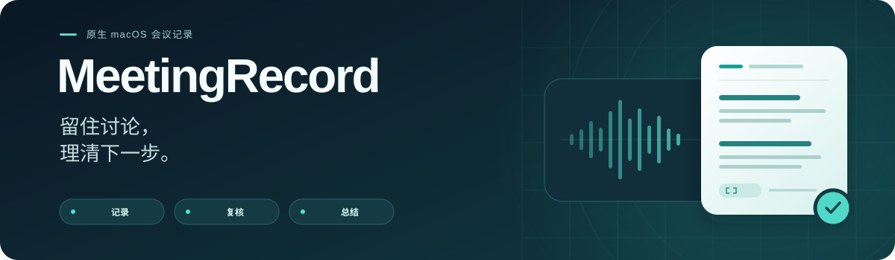
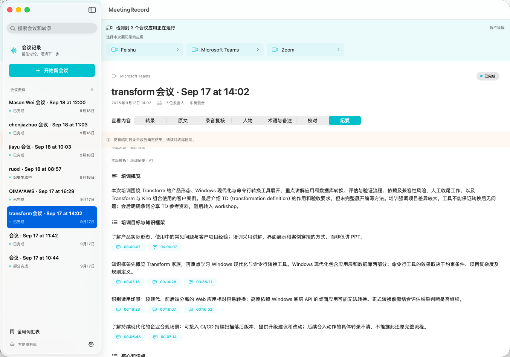

<p align="center">
  
</p>

<p align="center">
  <a href="README.md">English</a> · <a href="README.zh-CN.md">简体中文</a> · <a href="README.ja.md">日本語</a>
</p>

<p align="center"><strong>macOS 26+</strong> &nbsp; · &nbsp; SwiftUI &nbsp; · &nbsp; AWS Transcribe / Doubao + Responses API</p>

根据 [PRD](PRD.md) 开发的原生 SwiftUI 菜单栏应用。**0.6.1 为开发预览版**，支持中、英、日界面、实时转录、会后录音复核、可切换模型提供方的 AI 校对和自定义纪要模板，尚未实现 PRD 中的全部功能。

新增豆包流式语音识别 2.0：支持单路混音或双路识别，逐句二遍确认和说话人分离，按约人民币 0.93 元／音频小时显示估算费用。实时转录与会后复核可独立选择服务；[豆包文件复核](docs/RECORDING-REVIEW-PROVIDERS.md)采用单声道混音、私有 S3 临时存储，按约 0.80 元／音频小时估算。AWS 流程保持可用；详见[豆包实时转录](docs/DOUBAO-STREAMING.md)。

## 界面预览



<sub>中文界面；已保存的会议内容保留原有语言。</sub>

## 界面语言

打开 **设置 → 界面语言**，选择 **跟随系统、简体中文、English 或 日本語**。选择后立即生效并自动保存，覆盖主窗口、菜单栏面板和已打开的应用弹窗。默认跟随系统。

应用按系统语言列表的顺序，选用第一个支持的语言；均不匹配时使用英文。中文地区变体统一使用简体中文。内置模板的名称、说明和章节预览随界面语言切换，会议内容、自定义模板、人物姓名、人工修改和历史版本保持原样。

界面语言与识别语言、纪要语言相互独立。**AWS 实时和批量转录支持中文、日文、英文、中英混合及英日混合；豆包实时转录支持中文、英文和中英混合，文件复核另支持日文。** 英日混合需选择 AWS。纪要输出和自定义词汇表支持中、日、英三种语言。 切换界面不会改变这些已保存的选项，也不会翻译历史纪要。macOS 自带菜单、文件选择面板、权限提示和 Finder 中的应用名称由系统语言设置控制。详见[多语言说明](docs/LOCALIZATION.md)。

日语与多语言处理的参数、测试和真实 AWS 调用结果见[日语验证记录](docs/JAPANESE-VALIDATION.md)。

0.6.1 提供两种混合识别：中英混合、英日混合。旧三语模式仅保留历史记录和任务的读取、执行能力；若旧全局默认值为三语模式，新录音会回退为中英混合。详见[识别语言说明](docs/RECOGNITION-LANGUAGES.md)。

## 构建与运行

需要 macOS 26，以及 Xcode Command Line Tools / Swift 6.2 或更新版本。项目使用原生 Swift Package Manager，无需完整安装 Xcode。首次构建需要联网下载 AWS SDK 及其依赖，并预留数 GB 缓存空间。

```sh
bash scripts/test.sh
bash scripts/build-app.sh
open dist/MeetingRecord.app
```

也可以指定独立的应用输出路径：

```sh
bash scripts/build-app.sh debug dist/MeetingRecord-0.6.1.app
```

请从打包后的 `.app` 启动录音，其中包含 macOS 权限声明和多语言资源。`swift run` 不能替代应用安装与权限验证。当前使用本机临时签名；发布签名、公证和稳定的权限身份尚未实现。

构建脚本优先选择已安装的 macOS 26 SDK，并处理 Command Line Tools 下的 Swift Testing 插件发现问题。开发机上的 SDK 27 需要 Command Line Tools 未附带的 SwiftUI 宏插件，因此建议使用上述脚本。

## 功能

- 主窗口、菜单栏控制、会议历史和转录搜索。左侧资料库按今天、昨天、近 7 天、近 30 天及更早月份分区，支持折叠、数量显示和搜索自动展开。详见[会议资料分区](docs/MEETING-LIBRARY.md)。
- 选择运行中的 **Teams、Zoom、飞书 / Lark、腾讯会议或钉钉** macOS 客户端，以及麦克风、识别语言、云端转录和音频缓存。检测到的受支持客户端都会列出，由用户选择记录对象。
- Core Audio Process Tap 采集选定应用及其安装包内经过归属检查的音频辅助进程；AVAudioEngine 单独采集麦克风。暂不支持浏览器中的会议。
- 音源分别显示音量和状态，支持暂停、恢复及手动麦克风静音。本应用**不会自动跟随 Teams / Zoom 的静音状态**。关闭窗口后继续运行；有任务进行时，退出会提示确认。
- 实时转录可选 AWS Transcribe 或豆包流式语音识别 2.0。AWS 分别识别会议声音与麦克风；豆包默认将两路混为一路发送，也可选择双路独立识别，支持逐句二遍确认和说话人信息。
- 临时结果原位更新，确定结果去重保存。原文不可变，人工修订、人物信息与合并、单段归属、备注和重点标记单独管理。
- SQLite WAL 本地保存；缺口、断线、未确定的末尾转录、缓存失败和任务中断均有提示。收尾等待超时后保留已确定结果并标记未完成部分。
- 转录和 AI 版本可导出 Markdown / TXT，并提供无需录音的交互示例。Markdown 引用使用显式 HTML 锚点链接，需要预览器支持。
- 校对和总结共用一个 Bedrock Runtime Responses 或第三方 Responses API 连接，URL 和 Key 只配置一次；模型与推理强度可分别选择，支持统一连接验证和单场会议覆盖。
- 保守的 AI 校对，支持逐项复核和**全部接受**。人工编辑的转录受保护，敏感字词修改需要确认，标点修正也可撤销。
- 按模板生成纪要，验证原文引用，支持版本选择、输入过时提示、人工编辑另存新版本，以及从已保存的校对分块或纪要阶段重试。
- 全局中、日、英词汇表管理，支持批量粘贴、AWS 同步状态、按内容生成版本快照和清理未引用的旧版本。豆包可直接使用本地词条作为热词，无需 AWS 同步。
- 会后录音复核独立选择 AWS Transcribe 或豆包录音文件识别 2.0，支持手动或自动发起。对照后采用结果，实时原文、人工修改和历史 AI 版本均保留。

## 推荐流程

1. 在设置中选择实时转录、录音复核和 AI 模型服务。AWS 配置 profile、区域及所需 S3 桶；豆包保存 Key 并分别检查流式／文件连接。第三方文字模型按下方说明配置。词汇表用于 AWS 时先同步至 READY，用于豆包时直接作为热词传入。
2. 在受支持的桌面客户端中加入会议，选择会议应用和麦克风，确认采集及云端处理范围后开始记录。
3. 校对前补充人物信息、术语和备注。这些内容用于理解背景，备注不作为会议原话的证据。
4. 按需在**录音复核**中上传已保留的录音，执行批量转录。对照后采用某个版本，或恢复使用实时版。人物标签和人工修改不会在版本之间自动迁移。
5. 校对并确认建议，选择纪要模板，再生成或导出纪要。按钮上方显示将复用的校对版本号，纪要详情显示本版实际使用的校对版本；待确认的修改不会进入正文。历史版本继续保留。

自动校对和总结可在设置中关闭。会后重转录**默认手动执行**；选择自动模式后，新录音结束时会自动提交批量任务。自动批量模式会保留录音，并优先于自动 AI 处理：先等待复核、采用，再继续校对和总结。每场会议开始前均可单独调整。

批量上传使用已配置的同区域 S3 桶；专用桶留空时，复用全局词汇表的桶。任务中断后可再次查询已提交的作业。结果保存到本地后会尝试清理云端资源，清理失败可重试。停止本地等待后，云端识别任务可能仍在运行并计费。豆包文件复核需单独开通服务，使用两路混音及 S3 临时下载链接。详见[录音复核服务](docs/RECORDING-REVIEW-PROVIDERS.md)和 [AWS 批量转录说明](docs/BATCH-TRANSCRIPTION.md)。

## 模型提供方配置

打开 **设置 → AI 校对与纪要**，只配置一个模型服务连接，校对和总结共同使用。提供方、区域或 Proxy URL、API Key 设置一次即可；两阶段各自保留 Model ID 和推理强度。

| 提供方 | 需要配置 | Model ID |
| --- | --- | --- |
| AWS Bedrock Runtime（默认） | 本机 AWS profile、模型区域 | 保留四个 GPT 预设，也可选择“自定义 Model ID” |
| 第三方 Responses API | Proxy URL、API Key | 填写服务支持的完整 Model ID |

1. Bedrock 自定义 ID 按原样发送，不添加 `global.` 等前缀，需由所选区域和账户支持。第三方代理需兼容**非流式 Responses API**；仅支持 Chat Completions 的地址不可用。
2. Proxy URL 可填写 `https://proxy.example.com/v1`，也可填写完整的 `https://proxy.example.com/v1/responses`。界面会显示实际请求地址。远程代理使用 HTTPS；本机 localhost 可使用 HTTP。
3. 第三方 Key 输入后需单独点击 **保存 API Key**。Key 按 API 地址保存在本机钥匙串，同一地址可共用，切换地址需另行配置。**保存并关闭**用于保存模型设置，不会代替保存 Key。
4. 自定义模型默认选择 **服务默认（不发送 reasoning）**，也可指定服务支持的推理强度。统一的 **验证模型调用**检查两个阶段；模型和推理强度相同时只调用一次。检查只发送固定测试文字，会产生少量推理用量；第三方输入框留空时读取已保存的 Key。

全局设置用于新会议。已有会议可通过 **本会议 AI 设置**单独修改，或点击 **采用当前全局默认值**。历史校对、纪要和模型信息保持原样；更改配置后只影响后续处理。详细配置、地址规则和失败处理见[模型提供方说明](docs/MODEL-PROVIDERS.md)。

## 纪要模板

| 模板 | 关注内容 |
| --- | --- |
| 会议纪要 | 讨论、明确决策、行动项、待确认问题 |
| 面试纪要（面试官视角） | 候选人经历、问答、岗位能力证据、表现亮点、追问、已约定的后续事项 |
| 培训纪要 | 目标、知识框架、概念、操作步骤、案例、学员问答、实践与缺失信息 |

可在开始记录前或校对、纪要页面选择模板，也可在设置中指定默认模板。通过 **管理模板 → 新增模板**，填写名称、总结要求、概览标题，配置最多 16 个有序章节。章节类型包括要点、决策、带负责人／日期的行动项和待确认问题。内置模板只读，可以复制后修改。

模板库保存在本地偏好设置的 `summaryTemplateLibrary` 中。会议和生成的版本保存完整模板快照，编辑或删除模板不会改写历史记录。自定义章节标题原样使用；内置模板的输出标题遵循已保存的纪要语言，与界面预览语言独立。

仅在生成时将模板要求发送到所选模型服务。模板不能取消事实准确性、原文引用或人工备注隔离规则。面试模板不会推断招聘决定，也不会根据敏感个人属性作评价。

## 云端服务与数据

- 默认 AWS profile 为 `default`，区域为 `us-west-2`。Transcribe 区域与 AI 共用连接的区域独立配置；两个 AI 阶段的模型和推理强度可分别调整。
- Bedrock 使用 `https://bedrock-runtime.{region}.amazonaws.com/openai/v1/responses`，SigV4 服务名为 `bedrock`。Astra、Sol、Terra、Luna 预设使用 `global.openai.*` 推理配置，AWS 可能跨区域路由；自定义 Model ID 按原样发送。第三方请求只发往配置的代理端点，使用 Bearer API Key，不读取 AWS 凭证。
- 四个 Runtime 模型已在 0.5.1 完成真实连接验证。可用性仍取决于账号权限和服务支持的访问地区，不会静默更换模型、区域、推理强度或自动重试。详见 [Runtime 接入说明](docs/BEDROCK-RUNTIME.md)。
- SDK 在本机解析 AWS profile 凭证；豆包与第三方模型的 Key 保存到 macOS 钥匙串，不进入普通设置、会议快照或导出。模型请求不记录正文，不跟随 HTTP 重定向，不自动重试或切换提供方。
- AWS 实时转录将两路音频分别发送并计费；豆包默认只发送一路混音，选择双路识别时分别计费。录音复核先将保留的音频上传到 S3，再交给所选识别服务；豆包通过有时效的只读链接下载。识别、存储、流量和文字模型调用费用分别计算。启动应用或查看示例不会调用转录、推理服务。
- 文字处理将确定转录、人物信息、术语和必要备注发往共用连接下为各阶段选定的模型。请求设置 `store: false`；实际数据保留由所选服务及代理的政策决定，不能据此认为所有云端日志都已关闭。
- AWS 词汇表同步将词条和输出写法上传至已有的同区域 S3 桶，不上传本地备注；AWS 新录音只使用 READY 版本。豆包从本地词条中按接口限额选取热词直接发送。详见[词汇表设置与权限](docs/CUSTOM-VOCABULARY.md)。
- 本地数据位于 `~/Library/Application Support/MeetingRecord/`。数据库和缓存目录仅对当前用户开放，尚未增加数据库加密。
- 新安装的音频缓存默认关闭；已有用户沿用保存的设置。启用后，音频保留至删除会议，尚未实现自动到期清理。
- 删除本地会议会移除本机音频、转录和备注，不删除云端数据。请先清理尚未删除的批量资源；S3 版本控制可能保留旧对象版本。

只读环境检查：

```sh
python3 scripts/check-environment.py
python3 scripts/check-environment.py --aws --profile default --region us-west-2 --output docs/environment.json
```

检查不会录音、调用推理，也不保存账号 ID 或凭证。终端 STS 或模型目录查询成功，不代表图形应用中的所有凭证来源和模型权限均可用。

## 已知限制与验证

用户已验证 Teams 耳机会议的双路采集和转录。Zoom、飞书、腾讯会议、钉钉的真实通话，混合语言说话人分离、设备切换、外放回声和两小时稳定性仍需进一步验证。详见 [M0 验证记录](docs/M0-VALIDATION.md)和 [Teams 音频修复](docs/TEAMS-AUDIO-FIX.md)。

断网后可继续缓存音频并标记缺口，保留的音频可提交批量转录。自动重连、录音回听和缓存到期清理尚未实现；恢复实时连接请暂停后再恢复。AWS 批量转录暂不支持单个超过四小时的缓存文件；豆包复核会按连续覆盖的时间段混音并拆成不超过四小时的任务。发生故障时会保留已有结果，但不能保证转录完整。

2026-09-19 最近一次全套验证通过 **189 项测试**，并完成模型设置界面、App 构建和签名检查。第三方 Responses API 已通过模拟接口测试，并使用现有代理凭证对 `global.openai.gpt-5.6-sol`／`medium` 完成固定短文本实测，返回 HTTP 200。代理地址需包含服务要求的路径，例如 `/openai/v1`；各配置仍可用“验证模型调用”检查。详见[模型提供方验证范围](docs/MODEL-PROVIDERS.md)。

## 工程结构

```text
Sources/MeetingCore        模型、不可变原文、修订、模板、SQLite、导出、多语言
Sources/MeetingAudio       应用音频 Tap、麦克风、实时／离线混音、PCM 转换、本地缓存
Sources/MeetingCloud       实时／批量转录、词汇表、Bedrock / Proxy Responses、验证
Sources/MeetingRecordApp   SwiftUI、菜单栏、录音生命周期
Sources/MeetingAIValidate  显式模型／录音验证 CLI
Tests                     核心、音频、云端、多语言测试（不调用真实云端服务）
Resources                 图标、多语言权限说明、签名配置
scripts                   构建、测试、只读环境检查
docs                      功能细节和验证记录
```

仓库尚未建立 CodeGraph 索引；仅在创建 `.codegraph/` 后使用它定位代码。图标来源和许可见[图标说明](Resources/IconSource/README.md)。

构建后运行 `.build/out/Products/Debug/MeetingAIValidate --probe-models`，可用不含会议内容的固定短文本检查四个模型，遇到第一个错误即停止。`--latest` 或 `--meeting UUID` 会将真实会议发送到各阶段配置的模型服务并保存结果，仅在明确授权后使用，且需先退出桌面应用。`--summary-only` 仅重试总结阶段。历史变更见[版本记录](docs/CHANGELOG.zh-CN.md)。
